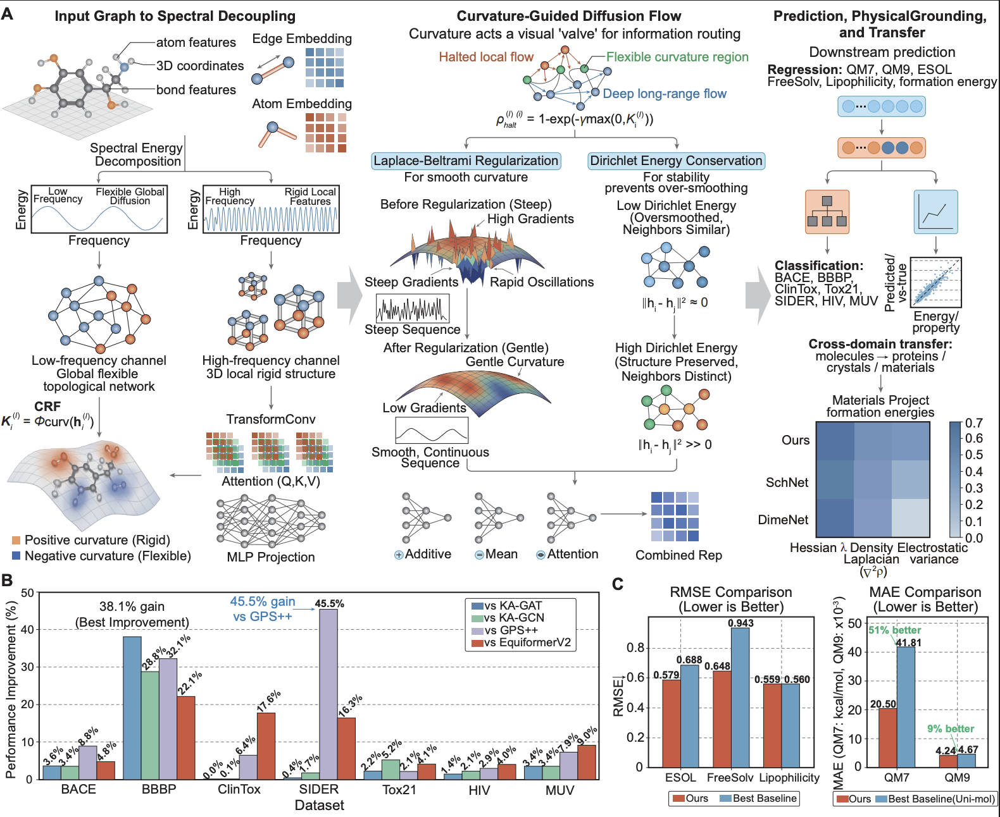

# Curvature-conditioned propagation enables long-range learning in molecular property prediction

## Abstract

Long-range interactions are central to molecular properties but remain difficult to capture with graph neural networks (GNNs) due to fixed-depth message passing. Here we show that propagation depth is not a fixed architectural choice, but a learnable, structure-dependent quantity governing information flow. We introduce PRISM, a curvature-conditioned framework in which each node is assigned a scalar curvature controlling how representations are aggregated across depths. This induces heterogeneous propagation regimes, enabling adaptive integration of local and non-local information. Through targeted interventions, we show that curvature acts as a causal control variable that modulates receptive fields and predictions. Falsification experiments confirm that alternative parameterizations fail to reproduce both structured propagation and performance. Across molecular benchmarks, PRISM achieves consistent gains, particularly in long-range tasks, while learned curvature aligns with quantum-derived descriptors.

## Framework Overview





## Quick Start

### 1) Environment

Install dependencies from `requirements.txt`:

```bash
pip install -r requirements.txt
```

### 2) How to Run
Classification example (BBBP):

```bash
python main_bbbp.py
```

Regression example (ESOL):

```bash
python main_esol.py
```

### 3) Hyperparameter Tuning

Training hyperparameters are configured in:

```text
configs/gat_path.yaml
```
