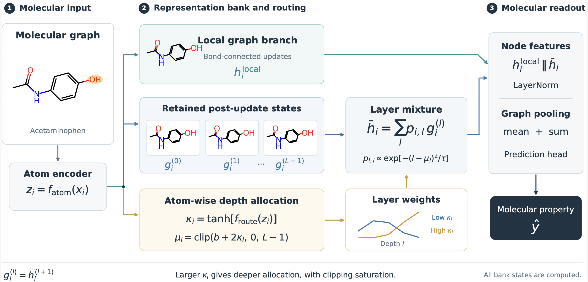

# Curvature-conditioned propagation enables long-range learning in molecular property prediction

## Abstract

Graph neural networks for molecular property prediction usually fix one propagation scale for every atom, either by reading only the final message-passing layer or by applying the same layer weights throughout a molecule. We present PRISM, in which each atom's encoded features produce a single bounded scalar that positions a unimodal distribution over a bank of retained post-update graph states, combined with a graph penalty on the scalar field and a mean-and-sum molecular readout. Because one coordinate translates the whole profile, the effect of the scalar on allocated depth is derived in closed form: allocation is nondecreasing in the scalar, its sensitivity scales with the variance of the depth distribution, and it saturates exactly where clipping applies. Under a matched protocol against six graph and geometric baselines, PRISM lowers mean test RMSE by 25.3%, 13.5%, and 13.7% on ESOL, FreeSolv, and Lipophilicity relative to the strongest comparator on each endpoint. Component removals and four alternative layer-weighting schemes each worsen performance, with the molecular readout dominating on hydration free energy and allocation mattering more on other tasks, so the gain is a property of the combination rather than of allocation alone. On Peptides-struct, PRISM reduces error relative to GIN at every tested depth while using 41--52% more time per epoch and 74--176% more memory, since all bank states are computed and the mechanism provides no early exit. The allocation rule has a precise computational interpretation; establishing a chemical one requires intervention experiments that we specify.

## Framework Overview





## Quick Start

### 1) Environment

Install dependencies from `requirements.txt`:

```bash
pip install -r requirements.txt
```

### 2) How to Run
Classification example (BBBP):

```bash
python main_bbbp.py
```

Regression example (ESOL):

```bash
python main_esol.py
```

### 3) Hyperparameter Tuning

Training hyperparameters are configured in:

```text
configs/gat_path.yaml
```
